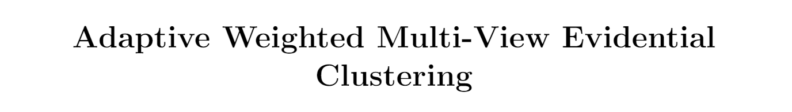

<div align=center>

</div>

## :hammer: Environment
MATLAB R2022b

## 🔥News!
The extended version of WMVEC is now available and accepted by [**Knowledge-Based Systems**](https://www.sciencedirect.com/science/article/pii/S0950705124004052).

Source and code are available at [WMVEC-FP Repo](https://github.com/JethroJames/WMVEC-FP).

**DOI**: [10.1016/j.knosys.2024.111770](https://doi.org/10.1016/j.knosys.2024.111770).

## :books: Citation

If you find our paper helps you, please kindly consider citing our paper in your publications.
```bash
@inproceedings{liu2023adaptive,
  title={Adaptive Weighted Multi-View Evidential Clustering},
  author={Liu, Zhe and Huang, Haojian and Letchmunan, Sukumar},
  booktitle={Int. Conf. Artif. Neural Networks},
  note={(In press)},
  year={2023}
}
```
